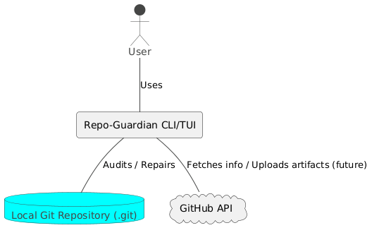

# Repo-Guardian

CLI/TUI utility to audit, repair, and re-linearize the integrity of any `.git` directory.

## Context Diagram

## Commands

| Command | Description |
|---------|-------------|
| `guardian scan <repo>` | (TODO) Scans the repository for issues. |
| `guardian export-graph <repo>` | (TODO) Exports the recovered DAG. |

## Installation

(TODO)